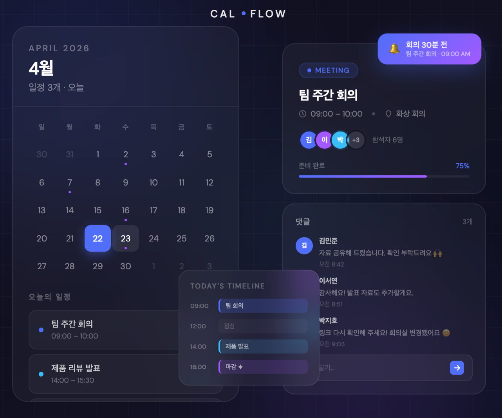
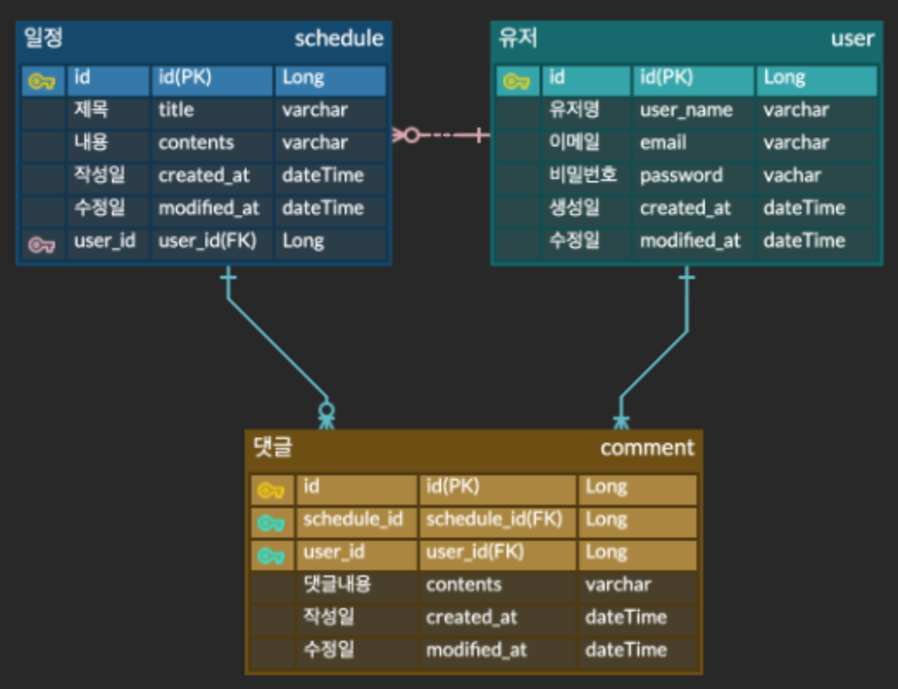

## CH 3 숙련 Spring_일정 관리 앱 Develop

### 1. 프로젝트 소개 

일정(Schedule), 유저(User), 댓글(Comment)을 관리할 수 있는 REST API 서버입니다.
사용자는 회원가입 및 로그인(Session 인증)을 통해 서비스를 이용할 수 있으며, 일정 생성/수정/삭제와 댓글 작성/조회 기능을 제공합니다.

### 2. 주요기능 
📌 일정 관리

- 일정 생성
- 일정 전체 조회
- 일정 단건 조회
- 일정 수정
- 일정 삭제

📌 유저 관리
- 유저 생성(회원가입)
- 유저 전체 조회
- 유저 단건 조회
- 유저 정보 수정
- 유저 삭제

📌 로그인 인증
- 이메일 + 비밀번호 로그인

📌 댓글 기능
- 일정에 댓글 작성
- 댓글 전체 조회

### 3. API 명세
https://documenter.getpostman.com/view/53063172/2sBXqFNhuh

### 4. ERD

### 5. 구현 기능

✅ 일정 / 유저 / 댓글 CRUD 구현
- RESTful API 방식으로 설계
- Controller / Service / Repository 계층 분리

✅ JPA Auditing 적용
- createdAt, modifiedAt 자동 생성 및 수정 시간 관리

✅ 엔티티 연관관계 설계
- User 1 : N Schedule
- Schedule 1 : N Comment
- Comment N : 1 User

✅ Validation 예외 처리
- @Valid, @NotBlank, @Size, @Email 등 적용
- @RestControllerAdvice 기반 전역 예외 처리

✅ 비밀번호 암호화
- PasswordEncoder 사용
- 회원가입 시 암호화 저장
- 로그인 시 비밀번호 검증

✅ Session 로그인 인증
- 로그인 성공 시 세션에 사용자 정보 저장
- 인증 상태 유지 가능

### 6. 사용방법
1. 프로젝트 실행
- Spring Boot 애플리케이션을 실행합니다.
- 기본 서버 주소: http://localhost:8080

2. API 테스트
- Postman을 사용하여 API를 테스트할 수 있습니다.

### 7. 트러블슈팅  
https://velog.io/@gksekqls21/CH-3-숙련-Spring일정-관리-앱-Develop-트러블슈팅